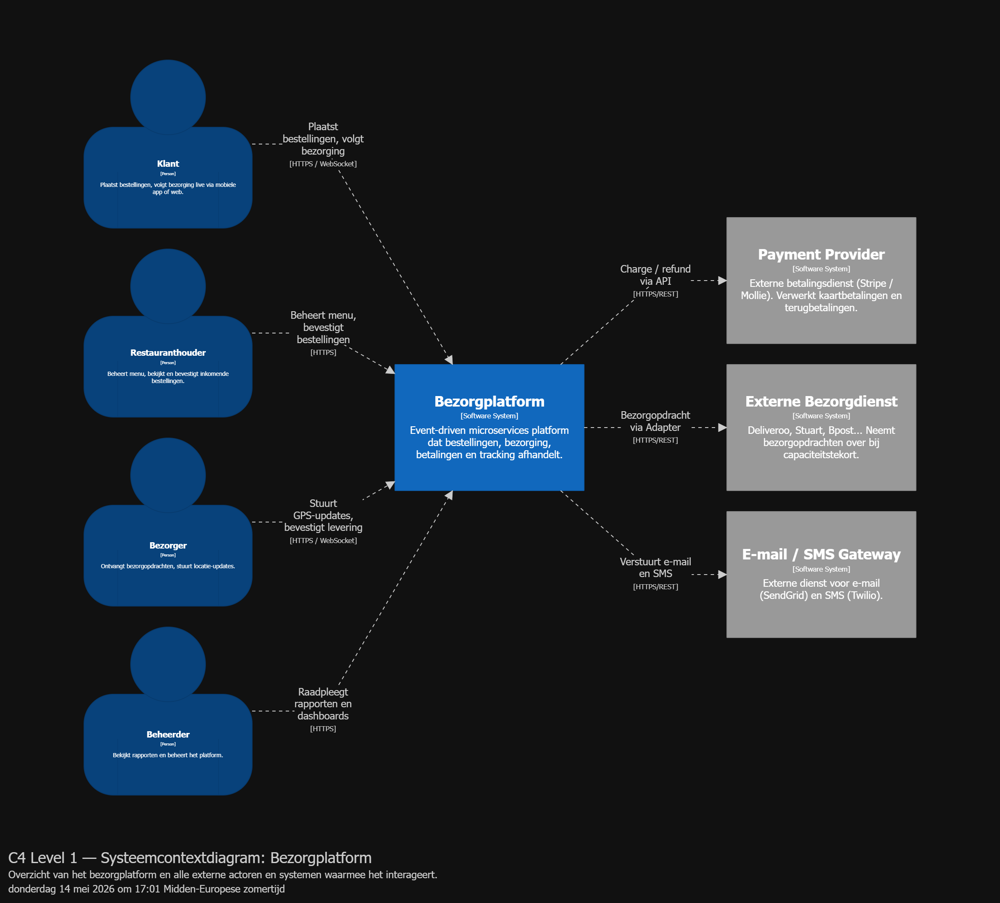
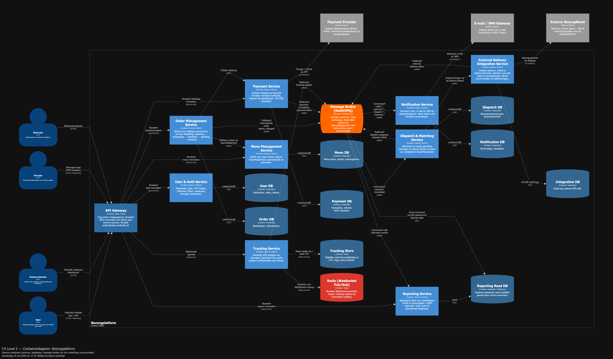
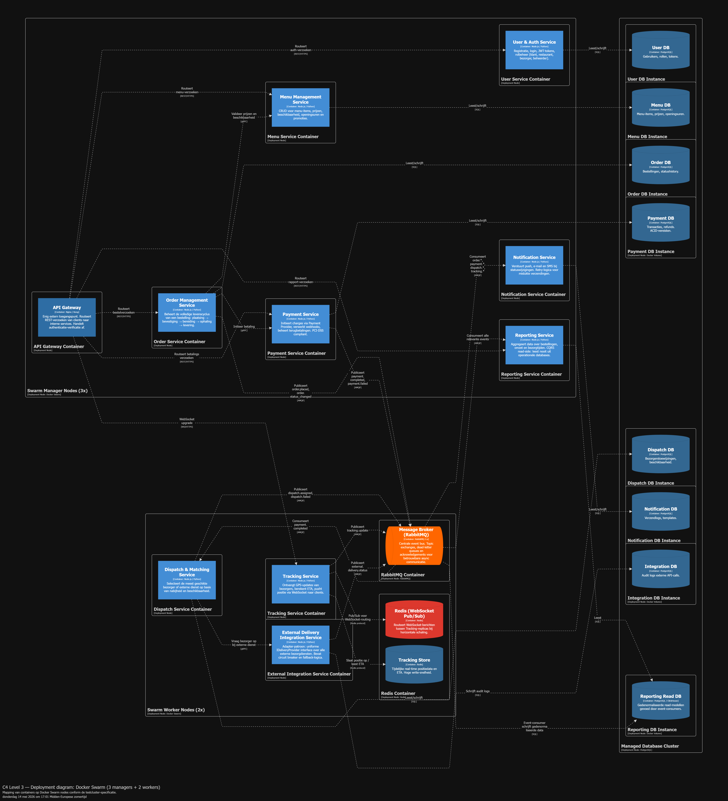

# ICTArchitectureProject

## Vereisten voor de restaurant- en bezorgapplicatie

De klant wil een applicatie voor restaurants om bestellingen en leveringen te beheren, inclusief integratie met externe bezorgdiensten. Vergelijkbare voorbeelden zijn Uber Eats en Deliveroo.

---

## 1. Karakteristieken

### 1.1 Interoperability

De klant wil integratie met externe bezorgdiensten, dus dit is een essentiële vereiste. Elke bezorgdienst heeft zijn eigen API en het systeem moet eenvoudig nieuwe diensten kunnen toevoegen en verwerken.

### 1.2 Elasticiteit

Afhankelijk van het tijdstip van de dag zullen er meer of minder requests zijn. Dit mag de kwaliteit van de gebruikerservaring niet negatief beïnvloeden.

### 1.3 Recoverability

Als het systeem uitvalt tijdens een bestelling, moet het correct kunnen herstellen zonder data te verliezen. Klanten die al betaald hebben, moeten hun bestelling nog steeds correct kunnen ontvangen.

### 1.4 Accuracy

Een bestelling die betaald is, moet altijd correct verwerkt en geleverd worden. Een bestelling die niet aankomt is onacceptabel en vormt een groot probleem voor zowel de klant als het bedrijf.

### 1.5 Security

Wanneer een klant bankgegevens invoert om een bestelling te betalen, mogen deze gegevens nooit uitlekken. In het algemeen moeten alle klantgegevens privé en beveiligd blijven, tenzij de klant expliciet anders toestemt.

### 1.6 Availability

Tijdens piekuren moet de applicatie even vlot blijven werken als tijdens rustige momenten. De prestaties en gebruikerservaring mogen niet verminderen bij hoge belasting.

### 1.7 Fault Tolerance

Wanneer er iets fout gaat, moet het systeem blijven functioneren door automatisch over te schakelen naar een alternatief. Als bijvoorbeeld Uber Eats niet beschikbaar is, moet het systeem automatisch een andere bezorgdienst kunnen gebruiken.

---

## 2. Logische componenten

> De logische componenten worden hier bepaald **vóór** de keuze van een architecturale stijl, op basis van een gecombineerde **actor-action** en **workflow**-aanpak: wie doet wat, en welke acties vloeien voort uit welke gebeurtenissen in het systeem?

### Klantbeheer (User & Auth Management)

Verantwoordelijk voor registratie, authenticatie en profielbeheer van klanten, restaurants en bezorgers. Beheert sessies, tokens en toegangsrechten. Vormt de poortwachter voor alle andere componenten.

### Menubeheer (Menu Management)

Staat restaurants toe hun menu, prijzen, beschikbaarheid van gerechten en openingsuren te beheren. Slaat de catalogus op en maakt deze doorzoekbaar voor klanten. Ondersteunt tijdelijke promoties en uitverkochte items.

### Bestelverwerking (Order Management)

Beheert de volledige levenscyclus van een bestelling: van plaatsing door de klant tot bevestiging door het restaurant, bereiding, ophaling en aflevering. Coördineert tussen klant, restaurant en dispatch.

### Betaalverwerking (Payment)

Verwerkt betalingen via externe payment providers (Stripe, Mollie...). Beheert terugbetalingen bij annulaties en fouten. Zorgt voor de financiële afrekening tussen het platform, restaurants en bezorgers. Voldoet aan PCI-DSS vereisten.

### Dispatch & Matching

Ontvangt een bevestigde bestelling en selecteert de meest geschikte bezorger of externe bezorgdienst op basis van beschikbaarheid, nabijheid en kostenefficiëntie. Implementeert fallback-logica indien een bezorger of dienst uitvalt.

### Real-time Tracking (Tracking)

Ontvangt periodiek positie-updates van bezorgers. Stelt klanten en restaurants in staat de live positie van de bezorger te volgen. Berekent en actualiseert de geschatte leveringstijd (ETA).

### Notificatiebeheer (Notification)

Stuurt berichten naar klanten (push, e-mail, SMS), restaurants (push, in-app) en bezorgers op basis van statuswijzigingen. Ondersteunt meerdere kanalen en prioriteiten. Handelt mislukte verzendingen af via retry-logica.

### Externe integratie (External Delivery Integration)

Kapselt de communicatie met externe bezorgdiensten (Deliveroo, Stuart, Bpost...) in. Biedt een uniforme interface ongeacht de API van de externe partij. Monitort de beschikbaarheid en prestaties van elke externe dienst.

### Rapportage & Analyse (Reporting)

Aggregeert data over bestellingen, inkomsten, bezorgtijden en gebruikersgedrag. Stelt beheerders en restauranthouders in staat rapporten te raadplegen. Leest enkel (CQRS read-side), nooit schrijven naar operationele data.

### 2.1 Overzicht verantwoordelijkheden

```
┌─────────────────────────────────────────────────────────────┐
│                    Logische componenten                      │
├─────────────────┬───────────────────────────────────────────┤
│ Component       │ Verantwoordelijkheden                      │
├─────────────────┼───────────────────────────────────────────┤
│ User & Auth     │ Registratie, login, tokens, rollen         │
│ Menu Mgmt       │ Catalogus, beschikbaarheid, prijzen        │
│ Order Mgmt      │ Levenscyclus bestelling, coördinatie       │
│ Payment         │ Charge, refund, afrekening, PCI-DSS        │
│ Dispatch        │ Matching bezorger/dienst, fallback         │
│ Tracking        │ Positie-updates, ETA-berekening            │
│ Notification    │ Push/SMS/mail, retry, templating           │
│ External Integ. │ Adapter per dienst, monitoring, failover   │
│ Reporting       │ Aggregatie, dashboards, read-only          │
└─────────────────┴───────────────────────────────────────────┘
```

---

## 3. ADR — Architecturale stijl

### ADR-001: Keuze van architecturale stijl

| Veld         | Waarde              |
| ------------ | ------------------- |
| **Status**   | Accepted            |
| **Datum**    | 2026-05             |
| **Beslissers** | Volledige projectgroep |

#### Context

We ontwerpen een bezorgplatform met meerdere actoren (klant, restaurant, bezorger, externe diensten), sterk wisselend verkeer, real-time vereisten en meerdere onafhankelijk evoluerende domeinen. De voornaamste spanning is:

- **Technische ideaalsituatie**: volledig gedistribueerd, maximaal schaalbaar
- **Praktische realiteit**: klein team (5 personen), beperkte tijd

We nemen de volgende stijlen in overweging:

1. Layered (N-tier) monoliet
2. Modulaire monoliet
3. Microservices
4. Event-driven architecture (EDA)
5. Service-oriented architecture (SOA)
6. Microkernel (plugin-gebaseerd)
7. Space-based architecture
8. Pipeline/Pipes & Filters
9. CQRS (Command Query Responsibility Segregation)

#### Overwogen alternatieven

**Layered monoliet**

- \+ Eenvoudig te starten, weinig operationele overhead
- \+ Eenvoudige deployments, één codebase
- \- Schaalt als één geheel; geen onafhankelijke schaling per component — bij een lunchpiek lijdt de volledige applicatie mee, ook onderdelen die niet onder druk staan
- \- Kleine wijzigingen vereisen herdeployment van het geheel, wat het releaseritme vertraagt
- \- Niet geschikt voor real-time en event-gebaseerde flows zoals live tracking

**Modulaire monoliet** *(tweede keuze — zie hieronder)*

- \+ Duidelijke domeinscheiding, goede onderhoudbaarheid
- \+ Lage operationele complexiteit
- \+ Eenvoudig te migreren naar microservices later
- \- Schaalt als geheel bij piek
- \- Moeilijker om real-time tracking en async notificaties te integreren
- \- Één failing module kan het geheel destabiliseren

**Microservices (zonder expliciete event bus)**

- \+ Maximale onafhankelijke schaalbaarheid en deployability
- \+ Technologische vrijheid per service
- \- Hoge operationele complexiteit (service discovery, distributed tracing...)
- \- Synchrone service-to-service calls creëren koppeling en verhogen latency
- \- Moeilijk te testen en te debuggen voor een klein team

**SOA**

- \+ Herbruikbare services, enterprise-bewezen
- \- Vereist zware middleware (ESB), hoge infrastructuurkost
- \- Niet geschikt voor moderne cloud-native deployments

**Microkernel**

- \+ Goed voor plugin-gebaseerde systemen waarbij functionaliteit op runtime kan worden uitgebreid
- \- Ons platform is geen pluginsysteem: de logische componenten (Order, Payment, Tracking...) zijn geen optionele plug-ins maar vaste, onderling afhankelijke domeinen. De plugin-metafoor past niet bij de architecturale vraag.

**Space-based architecture**

- \+ Uiterst schaalbaar voor enorm hoge volumes
- \- Extreem complex, overkill voor dit projectformaat

**Pipes & Filters**

- \+ Geschikt voor data-transformatiepipelines
- \- Niet geschikt als overkoepelende architectuurstijl voor een transactioneel platform; dekt toestandsbeheer en actor-interacties niet af

**CQRS (Command Query Responsibility Segregation)**

- \+ Sterke scheiding tussen schrijf- en leesoperaties; ideaal voor rapportage en audit trails
- \+ Leesstroom kan onafhankelijk worden geschaald en geoptimaliseerd (read-replicas, projecties)
- \- Als zelfstandige overkoepelende stijl schiet CQRS tekort: het regelt niet hoe services onderling communiceren of hoe ze gedeployed worden
- \- Introduceert eventual consistency op de read-side, wat bewuste keuzes vereist voor de gebruikerservaring
- \-> CQRS wordt **niet** gekozen als architecturale stijl, maar **wel** toegepast als patroon binnen de Reporting-component (zie ADR-004)

**Event-Driven Architecture + Microservices** *(gekozen stijl)*

- \+ Elk logisch component wordt een losjes gekoppelde service
- \+ Asynchrone communicatie via events verlaagt koppeling drastisch
- \+ Componenten schalen onafhankelijk (bv. Tracking en Dispatch bij piek)
- \+ Fault tolerance: als Notification uitvalt, kunnen bestellingen doorgaan
- \+ Extensibility: nieuwe services subscriben op bestaande events zonder wijzigingen
- \- Hogere operationele complexiteit dan een monoliet
- \- Eventual consistency vereist bewuste keuzes en compenserende transacties
- \- Debugging van asynchrone flows vereist distributed tracing (OpenTelemetry)

#### Beslissing

We kiezen voor **Event-Driven Architecture (EDA) met Microservices**. Elk logisch component uit sectie 2 wordt een afzonderlijke service die communiceert via een centrale message broker (zie ADR-002). Synchrone REST/gRPC wordt enkel gebruikt waar directe respons vereist is (bv. betaalinitatie, menu ophalen).

#### Tweede keuze: Modulaire monoliet

Indien de operationele complexiteit van EDA + microservices het team te zwaar belast (bv. bij een team van 2 personen of een kortere tijdshorizon), is een **modulaire monoliet** de beste alternatieve keuze. De domeinmodules zijn identiek aan de logische componenten uit sectie 2, maar gedeployed als één applicatie. De overgang naar microservices later blijft mogelijk door strikte module-grenzen en een interne event bus (bv. MediatR in .NET of een in-process event dispatcher).

#### Gevolgen

- Elke service krijgt een eigen codebase, CI/CD pipeline en (bij voorkeur) eigen datastore.
- Communicatie tussen services verloopt primair via events op de message broker.
- Distributed tracing (OpenTelemetry + Jaeger) is vereist voor observability.
- Een API Gateway wordt toegevoegd als enig toegangspunt voor externe clients.

---

## 4. Verdere beslissingen (ADR's)

### ADR-002: Message Broker

| Veld       | Waarde   |
| ---------- | -------- |
| **Status** | Accepted |
| **Datum**  | 2026-05  |
| **Beslissers** | Volledige projectgroep |

#### Context

De event-driven architectuur vereist een betrouwbare, schaalbare message broker voor asynchrone communicatie tussen services. Centrale keuze: Apache Kafka vs. RabbitMQ vs. NATS vs. Redis Streams.

#### Overwogen alternatieven

| Optie             | Pro                                                                 | Con                                                                      |
| ----------------- | ------------------------------------------------------------------- | ------------------------------------------------------------------------ |
| **Apache Kafka**  | Hoge throughput, persistente log, replay mogelijk, topic-partities  | Hoge operationele complexiteit (Zookeeper/KRaft), overkill voor klein volume |
| **RabbitMQ**      | Eenvoudig, mature, flexibele routing (exchanges), lage latency      | Geen persistente log, moeilijker horizontaal te schalen                  |
| **NATS**          | Extreem lage latency, cloud-native, eenvoudig                       | Minder volwassen ecosysteem, beperkte persistentie in basis              |
| **Redis Streams** | Laagdrempelig, al aanwezig als cache                                | Niet ontworpen als primaire message broker, beperkte tooling             |

#### Beslissing

We kiezen voor **RabbitMQ**. Het volume van een MVP-bezorgplatform rechtvaardigt de complexiteit van Kafka niet. RabbitMQ biedt voldoende routing-flexibiliteit (topic exchanges), betrouwbare delivery (acknowledgements, dead-letter queues) en een mature beheerconsole. Indien het platform naar productie gaat en het berichtenvolume stijgt naar miljoenen events per dag, migreren we naar Kafka.

#### Gevolgen

- RabbitMQ wordt gedeployed als Docker service met management plugin.
- Elke service publiceert en consumeert via dedicated exchanges en queues.
- Dead-letter queues worden geconfigureerd voor foutafhandeling.
- Berichten worden geserialiseerd als JSON met een versie-header voor schema-evolutie.

---

### ADR-003: Real-time communicatie naar clients

| Veld       | Waarde   |
| ---------- | -------- |
| **Status** | Accepted |
| **Datum**  | 2026-05  |
| **Beslissers** | Volledige projectgroep |

#### Context

Klanten en restaurants hebben nood aan real-time updates: bezorgerlocatie, bestelstatus, ETA. De vraag is welk protocol we hiervoor inzetten aan de client-kant.

#### Overwogen alternatieven

| Optie                      | Pro                                                             | Con                                                                                         |
| -------------------------- | --------------------------------------------------------------- | ------------------------------------------------------------------------------------------- |
| **WebSockets**             | Bidirectioneel, laag overhead na handshake, brede support       | Persistente connectie, complexer bij load balancing (sticky sessions of Redis pub/sub)      |
| **Server-Sent Events (SSE)** | Eenvoudig, native HTTP, automatische reconnect, eenrichtings  | Enkel server→client, geen bidirectionele interactie                                         |
| **Short Polling**          | Triviaal te implementeren                                       | Hoge serverbelasting, latency tot aan polling-interval                                      |
| **Long Polling**           | Lagere latency dan short polling                                | Complexe server-side afhandeling, niet schaalbaar                                           |

#### Beslissing

We kiezen voor **WebSockets** via een dedicated Tracking-service. Hoewel SSE eenvoudiger is, verwachten we dat de mobiele client ook berichten naar de server wil sturen (bv. "bestelling ontvangen" bevestiging). Bij horizontale schaling gebruiken we een Redis pub/sub adapter zodat WebSocket-berichten correct worden gerouteerd ongeacht op welke node de client verbonden is.

#### Gevolgen

- De Tracking-service exposeert een WebSocket-endpoint.
- Load balancer wordt geconfigureerd voor WebSocket-upgrade (HTTP 101).
- Een Redis-instantie wordt toegevoegd voor pub/sub bij meerdere Tracking-replicas.
- Clients implementeren reconnect-logica met exponential backoff.

---

### ADR-004: Database-strategie

| Veld       | Waarde   |
| ---------- | -------- |
| **Status** | Accepted |
| **Datum**  | 2026-05  |
| **Beslissers** | Volledige projectgroep |

#### Context

In een microservices-architectuur is de canonieke aanpak "database per service". Dit verhoogt autonomie maar introduceert complexiteit bij queries die meerdere domeinen overspannen.

#### Overwogen alternatieven

| Optie                       | Pro                                                                     | Con                                                                              |
| --------------------------- | ----------------------------------------------------------------------- | -------------------------------------------------------------------------------- |
| **Shared database**         | Eenvoudige joins, één beheer-vlak                                       | Koppeling op schemavlak, schaalt niet onafhankelijk, één point of failure        |
| **Database per service**    | Maximale autonomie, technologievrijheid, onafhankelijk schalen          | Geen cross-service joins, eventual consistency, meer operationele overhead       |
| **CQRS + read-replicas**    | Optimale read-schaalbaarheid, scheiding lees/schrijf                    | Extra complexiteit, data-duplicatie in read-modellen                             |

#### Beslissing

We kiezen voor **database per service**, aangevuld met **CQRS voor de Reporting-component**. Elke service beheert zijn eigen schema en datastore. Cross-service data-behoeften worden opgelost via events (denormalisatie in de ontvangende service) of via de API Gateway (data composition). De Reporting-component leest uit een aparte read-database die gevoed wordt door event-consumers.

Technologiekeuzes per service:

| Service              | Database                                       |
| -------------------- | ---------------------------------------------- |
| User & Auth          | PostgreSQL (relationeel, ACID voor auth)        |
| Menu Management      | PostgreSQL                                     |
| Order Management     | PostgreSQL (transacties)                       |
| Payment              | PostgreSQL (ACID absoluut vereist)             |
| Dispatch             | PostgreSQL                                     |
| Tracking             | Redis (tijdelijke positiedata, hoge write-snelheid) |
| Notification         | PostgreSQL (logs)                              |
| External Integration | PostgreSQL                                     |
| Reporting            | PostgreSQL read-replica + eventueel ClickHouse |

#### Gevolgen

- Geen cross-service database joins; data-synchronisatie via events.
- Elke service draait zijn eigen migraties (bv. Flyway, Alembic).
- Saga-patroon wordt gebruikt voor gedistribueerde transacties (bv. betaling + bestelling).

---

### ADR-005: Externe integratiestrategie

| Veld       | Waarde   |
| ---------- | -------- |
| **Status** | Accepted |
| **Datum**  | 2026-05  |
| **Beslissers** | Volledige projectgroep |

#### Context

Het platform integreert met meerdere externe bezorgdiensten (Deliveroo, Stuart, eventueel eigen vloot). Elke dienst heeft een eigen API, eigen authenticatiemechanisme en eigen foutgedrag. Hoe kapselen we dit in?

#### Overwogen alternatieven

| Optie                            | Pro                                                          | Con                                                                             |
| -------------------------------- | ------------------------------------------------------------ | ------------------------------------------------------------------------------- |
| **Directe integratie per service** | Eenvoudig initieel                                         | Elke service kent externe API-details, hoge koppeling, duplicaat retry/fallback logica |
| **Adapter-patroon per externe dienst** | Uniforme interface intern, externe details geïsoleerd  | Iets meer initiële code                                                         |
| **Anti-Corruption Layer (ACL)**  | Extern domeinmodel vertaald naar intern model                | Formeler, iets meer overhead                                                    |
| **API Gateway als proxy**        | Centraal, auditeerbaar                                       | Gateway wordt bottleneck, verantwoordelijkheden vermengen                       |

#### Beslissing

We kiezen voor het **Adapter-patroon** binnen een dedicated External Delivery Integration-service. Elke externe dienst krijgt een eigen adapter-klasse die dezelfde interne interface implementeert (`IDeliveryProvider`). De Dispatch-service communiceert enkel met deze interne interface en weet niet welke externe dienst gebruikt wordt. Failover-logica (circuit breaker, retry met andere provider) zit centraal in de Integration-service.

#### Gevolgen

- Een nieuwe externe bezorgdienst toevoegen = één nieuwe adapter schrijven, geen wijzigingen elders.
- Circuit breaker-patroon (bv. Resilience4j, Polly) per adapter.
- API-sleutels worden opgeslagen in een secrets manager (Docker Secrets in Swarm).
- De Integration-service logt alle uitgaande calls voor auditdoeleinden.

---

### ADR-006: API-stijl tussen services en clients

| Veld       | Waarde   |
| ---------- | -------- |
| **Status** | Accepted |
| **Datum**  | 2026-05  |
| **Beslissers** | Volledige projectgroep |

#### Context

De API Gateway routeert verkeer van externe clients (mobiele app, webinterface, restaurantdashboard) naar interne services. Tegelijk communiceren services onderling voor synchrone operaties (bv. Order Service die Menu Service raadpleegt voor prijsvalidatie). We moeten kiezen welke API-stijl we hanteren voor beide communicatievectoren.

#### Overwogen alternatieven

| Optie                   | Pro                                                                               | Con                                                                        |
| ----------------------- | --------------------------------------------------------------------------------- | -------------------------------------------------------------------------- |
| **REST (JSON over HTTP)** | Universeel, tooling overal beschikbaar, eenvoudig te debuggen, stateless        | Geen sterk schema, over-fetching/under-fetching, geen streaming            |
| **GraphQL**             | Flexibele queries, no over-fetching, sterk typed schema                           | Hoge leercurve, complexe server-side implementatie, caching moeilijker     |
| **gRPC**                | Hoge performantie, sterk typed (Protobuf), native streaming, code-generatie       | Moeilijker te debuggen (binair), minder browserondersteuning, extra tooling |
| **tRPC**                | End-to-end type safety (TypeScript), zero schema boilerplate                      | Enkel bruikbaar binnen TypeScript-ecosysteem                               |
| **AsyncAPI / event-only** | Maximale ontkoppeling                                                           | Synchrone operaties blijven een realiteit, niet volledig te vermijden      |

#### Beslissing

We hanteren een **hybride aanpak**:

- **Client → API Gateway → service:** REST (JSON over HTTPS). Clients zijn divers (mobiel, web, restaurant-tablet) en REST is het laagdrempeligst voor integratie en debugging. OpenAPI-spec wordt gegenereerd per service.
- **Service → service (synchroon):** gRPC. Interne synchrone calls (bv. Order → Menu voor prijsvalidatie, Payment → Order voor statusupdate) profiteren van Protobuf-serialisatie (sneller, kleiner) en sterke contracten. Code-generatie vermindert integratiefouten.
- **Service → service (asynchroon):** RabbitMQ events (zie ADR-002), JSON payload.

#### Gevolgen

- De API Gateway vertaalt REST-verzoeken van clients; interne services spreken gRPC waar nodig.
- Per service wordt een `.proto`-bestand bijgehouden als contractdefinitie.
- gRPC-health-checks worden gebruikt voor Docker Swarm service-monitoring.
- REST-endpoints worden gedocumenteerd via OpenAPI (Swagger UI beschikbaar in dev).

---

## Diagrammen

**Level 1 — Systeemcontextdiagram:**



**Level 2 — Containerdiagram:**



**Level 3 — Deployment diagram:**


